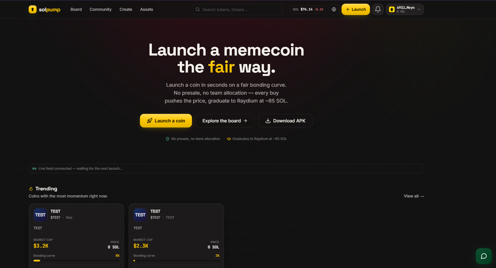
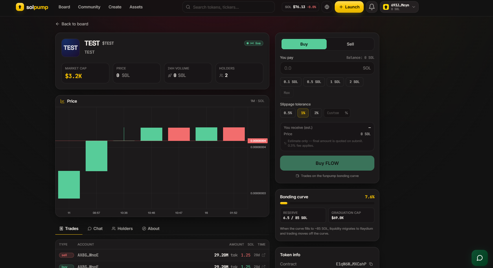
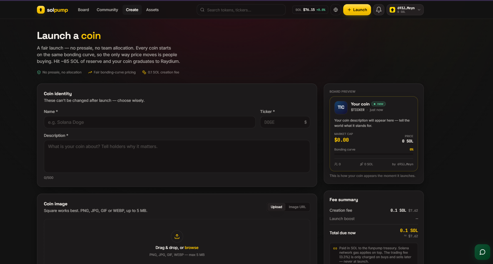
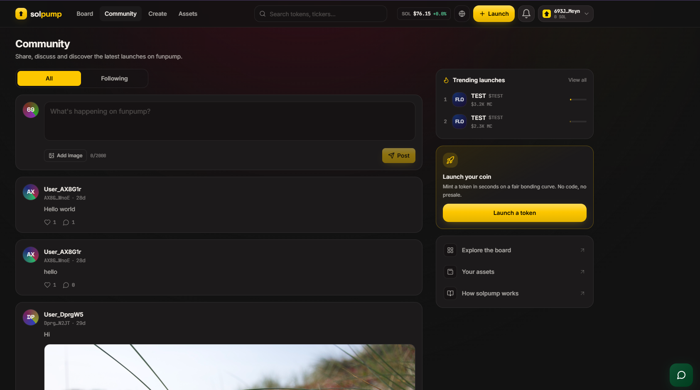

# 🚀 WhiteLabel Pump.fun Clone

### Solana Token Launchpad, Meme Coin Creator, Bonding Curve Trading & Web3 Community

**Mobile App • Web App • Token Creator • Token Launchpad • Trading • Wallet • Community**

🚀 Production Ready • White Label • Fully Scalable

📱 iOS & Android

📩 **Telegram:** @edwardgarciaa

---

  

  

  

# 🚀 Overview

Launch your own **Pump.fun-style Solana token launchpad** under your own brand.

Create a complete platform where users can create and launch their own meme coins, discover new tokens, trade tokens through bonding curves, monitor market activity and interact with the community.

The platform combines:

- 🪙 Token Launchpad
- 🚀 Meme Coin Creator
- 📈 Bonding Curve Trading
- 💱 Token Buy & Sell
- 📊 Token Analytics
- 🔥 Trending Tokens
- 🚀 Token Graduation
- 👛 Solana Wallet
- 👥 Web3 Community
- 📱 iOS & Android Mobile App
- 🌐 Web Application
- 💻 Admin Panel

---

# 📱 Mobile App

Launch your own token launchpad directly on mobile.

The platform includes a dedicated **Flutter mobile application for iOS and Android**, allowing users to access the core Web3 experience from their smartphones.

### Mobile Features

- 🔐 Wallet Creation & Import
- 👛 Solana Wallet
- 🪙 Token Discovery
- 🚀 Token Launch
- 📈 Token Trading
- 💱 Buy & Sell
- 📊 Token Charts
- 🔥 Trending Tokens
- 🎒 Token Portfolio
- 👥 Community Feed
- 💬 Comments & Replies
- ❤️ Likes
- 👤 User Profiles
- 🔔 Notifications
- 📜 Transaction History
- ⚙️ Account Settings

---

# 🪙 Token Launchpad

Create and launch Solana tokens through your own platform.

Features:

- Create Token
- Token Name
- Token Symbol
- Token Description
- Token Logo
- Custom Metadata
- Website
- Twitter / X
- Telegram
- Discord
- Social Links
- Token Launch
- Token Management

Give users everything they need to launch their own meme coins.

---

# 🐸 Meme Coin Creator

Build your own meme coin creation ecosystem.

Users can configure:

- Token Name
- Ticker
- Logo
- Description
- Social Profiles
- Website
- Telegram
- Twitter / X
- Discord
- Token Metadata

Users can launch their token and immediately make it available for discovery and trading.

---

# 📈 Bonding Curve Trading

A core feature for building a **Pump.fun-style launchpad experience**.

Features:

- Buy Tokens
- Sell Tokens
- Dynamic Token Pricing
- Bonding Curve
- Real-Time Price
- Market Cap
- Liquidity Tracking
- Trading Volume
- Buy/Sell History
- Automatic Price Calculation
- Slippage Settings

Token prices can dynamically change based on the configured bonding curve model.

---

# 💱 Token Trading

Allow users to trade newly launched tokens directly from the platform.

Features:

- Instant Buy
- Instant Sell
- SOL Trading Pair
- Token Balance
- Transaction Preview
- Slippage Configuration
- Live Price
- Trading History
- Transaction Status
- Wallet Integration

---

# 🔥 Token Discovery

Help users discover the next trending meme coin.

Dedicated discovery sections can include:

- 🔥 Trending
- 🆕 New Tokens
- 📈 Biggest Gainers
- 💰 Highest Market Cap
- 📊 Highest Volume
- 👀 Most Viewed
- 🚀 Recently Launched
- 🎯 Graduating Tokens
- ⚡ Latest Trades

---

# 📊 Token Analytics

Every token can have its own dedicated trading page.

Display:

- Current Price
- Market Cap
- Liquidity
- Trading Volume
- Price Change
- Holders
- Transactions
- Buy/Sell Activity
- Price Chart
- Token Information
- Creator Information
- Social Links

---

# 📈 Advanced Token Charts

Give traders a complete overview of token performance.

Features:

- Live Price Chart
- Multiple Timeframes
- Trading History
- Buy/Sell Markers
- Volume Data
- Market Cap Tracking
- Price Movement
- Real-Time Updates

---

# 🚀 Token Graduation

Track tokens reaching configured platform milestones.

Features:

- Market Cap Threshold
- Liquidity Threshold
- Graduation Progress
- Graduation Status
- Graduation History
- DEX Migration
- Graduated Token Listings

Create a clear progression from **new token → bonding curve → graduation → DEX liquidity**.

---

# 🌐 DEX Integration

Connect launched tokens with decentralized exchanges.

Possible functionality:

- Liquidity Migration
- DEX Trading
- Token Migration
- Trading Pair Creation
- Liquidity Tracking
- DEX Links
- Trading Information

---

# 👛 Solana Wallet

Built-in Web3 wallet functionality.

Features:

- Create Wallet
- Import Wallet
- Wallet Address
- Send SOL
- Receive SOL
- Token Balances
- Transaction History
- QR Code
- Wallet Connection
- Secure Transaction Signing

---

# 🔐 Non-Custodial Wallet

Users maintain control over their wallet credentials.

Features:

- Recovery Phrase
- Secure Key Storage
- Wallet Import
- Wallet Export
- Transaction Signing
- PIN Protection
- Biometric Authentication

---

# 🪙 SPL Token Support

Manage Solana-based assets from one interface.

Features:

- SPL Tokens
- Token Balances
- Token Metadata
- Token Logos
- Token Prices
- Token Transactions
- Token Holdings

---

# 👥 Web3 Community

Build a community around your token ecosystem.

Features:

- Community Feed
- Token Comments
- User Profiles
- Replies
- Likes
- Following
- Followers
- Social Links
- Community Activity
- Token Discussions

Users can interact with token creators and other traders directly inside the platform.

---

# 👤 User Profiles

Create Web3-focused user profiles.

Includes:

- Username
- Profile Picture
- Wallet Address
- Created Tokens
- Trading Activity
- Followers
- Following
- Community Posts
- Social Links

---

# 🔔 Notifications

Keep users informed about platform activity.

Notifications can include:

- New Token Launches
- Token Purchases
- Token Sales
- Comments
- Replies
- Likes
- New Followers
- Graduation Events
- Platform Announcements

---

# 🏆 Leaderboards

Create competitive rankings for your community.

Possible rankings:

- Top Traders
- Biggest Winners
- Highest Volume
- Top Token Creators
- Most Followed Users
- Trending Tokens
- Highest Market Cap
- Biggest Gainers

---

# 🔎 Search & Discovery

Powerful search system for tokens and users.

Search by:

- Token Name
- Token Symbol
- Contract Address
- Username
- Wallet Address

Filter by:

- Market Cap
- Volume
- Price
- Token Age
- Trending
- Newest

---

# 💰 Platform Monetization

Create multiple revenue streams from your platform.

Possible monetization models:

- Token Creation Fees
- Trading Fees
- Buy Fees
- Sell Fees
- Graduation Fees
- Featured Token Listings
- Sponsored Tokens
- Advertising
- Premium Features
- Referral Commissions

Configure your own fee structure through the administration system.

---

# 👥 Referral System

Grow your platform through referrals.

Features:

- Referral Links
- Invite Friends
- Referral Tracking
- Commission Management
- Referral Bonuses
- Referral Statistics

---

# 🎁 Promotional System

Create campaigns to increase engagement.

Features:

- Promo Codes
- Launch Promotions
- Featured Tokens
- Sponsored Listings
- Referral Bonuses
- Promotional Campaigns

---

# 💻 Admin Panel

Manage the entire platform from one centralized dashboard.

## 📊 Dashboard

Monitor:

- Total Users
- Active Users
- Tokens Created
- Trading Volume
- Trading Fees
- Platform Revenue
- Transactions
- Graduated Tokens
- Community Activity
- Recent Activity

---

# 🪙 Token Management

Manage every token launched through the platform.

Features:

- Token Listings
- Token Information
- Token Status
- Creator Information
- Market Data
- Trading Activity
- Featured Status
- Token Moderation
- Token Removal

---

# 📈 Trading Management

Monitor platform trading activity.

- Buy Transactions
- Sell Transactions
- Trading Volume
- Trading Fees
- Transaction History
- Failed Transactions
- Trading Statistics

---

# 🚀 Graduation Management

Configure and manage token graduation rules.

Manage:

- Market Cap Threshold
- Liquidity Threshold
- Graduation Rules
- Migration Settings
- DEX Configuration
- Graduated Tokens

---

# 👥 User Management

Manage all registered users.

Features:

- User Profiles
- Wallet Addresses
- Created Tokens
- Account Status
- User Activity
- Community Activity
- Referral Statistics
- Account Restrictions
- User Moderation

---

# 🛡️ Moderation

Keep the platform and community clean.

Manage:

- Token Reports
- User Reports
- Comments
- Spam
- Suspicious Content
- Featured Listings
- Banned Users

---

# 💰 Fee Management

Configure your platform revenue.

Manage:

- Token Creation Fees
- Trading Fees
- Buy Fees
- Sell Fees
- Graduation Fees
- Referral Commissions

---

# 📢 Marketing Management

Create promotional campaigns.

Features:

- Featured Tokens
- Sponsored Listings
- Banner Campaigns
- Promotional Content
- Campaign Scheduling
- Performance Tracking

---

# 📊 Analytics

Track your complete platform performance.

- Daily Users
- New Users
- Token Launches
- Trading Volume
- Transaction Count
- Platform Fees
- Revenue
- Popular Tokens
- User Activity
- Community Growth

---

# 🌐 CMS

Manage public-facing content without modifying source code.

Pages can include:

- Homepage
- About
- FAQ
- Blog
- Terms & Conditions
- Privacy Policy
- Risk Disclaimer
- Community Guidelines

---

# ⚙️ Platform Settings

Configure your platform from the admin panel.

Manage:

- Brand Name
- Logo
- Favicon
- Platform Fees
- Solana Network
- RPC Configuration
- DEX Settings
- API Keys
- Social Links
- Email Settings
- Notifications
- Maintenance Mode

---

# 🎨 White Label

Launch the complete platform under your own brand.

Customize:

- Brand Name
- Logo
- Favicon
- Colors
- Domain
- Homepage
- Token Creation Settings
- Fee Structure
- Social Links
- Platform Content

**No vendor branding.**

---

# 🌐 Web Application

A modern responsive web application for desktop and mobile browsers.

Features include:

- Token Launchpad
- Token Discovery
- Token Trading
- Token Charts
- Wallet
- Portfolio
- Community
- User Profiles
- Notifications
- Admin Panel
- CMS

---

# 📱 Mobile + Web + Admin

A complete multi-platform ecosystem:

### 📱 Mobile

- iOS
- Android
- Flutter

### 🌐 Web

- Responsive Web Application
- Token Launchpad
- Trading
- Community
- Wallet

### 💻 Admin

- Token Management
- User Management
- Trading Management
- Fee Management
- Analytics
- CMS
- Platform Settings

---

# 🛠 Technology

### Blockchain

- Solana
- SOL
- SPL Tokens

### Mobile

- Flutter
- Dart
- iOS
- Android

### Web

- Modern Web Interface
- Responsive UI
- Web3 Integration

### Backend

- Node.js
- Express.js
- REST API

### Database

- MongoDB

---

# 📦 What's Included

✅ Pump.fun-Style Token Launchpad

✅ Meme Coin Creator

✅ Token Creation System

✅ Bonding Curve Trading

✅ Buy & Sell System

✅ Token Discovery

✅ Trending Tokens

✅ Token Analytics

✅ Price Charts

✅ Token Graduation

✅ DEX Integration Ready

✅ Solana Wallet

✅ SPL Token Support

✅ Web3 Community

✅ User Profiles

✅ Referral System

✅ Monetization System

✅ Mobile App

✅ iOS App

✅ Android App

✅ Web Application

✅ Admin Panel

✅ Source Code

✅ Documentation

✅ White Label License

---

# ⭐ Why Choose This Platform?

- 🚀 Pump.fun-Style Launchpad
- 🪙 Meme Coin Creator
- 📈 Bonding Curve
- 💱 Token Trading
- 🔥 Trending Tokens
- 📊 Token Analytics
- 🚀 Token Graduation
- 🌐 DEX Ready
- 👛 Solana Wallet
- 🪙 SPL Tokens
- 👥 Web3 Community
- 📱 iOS & Android
- 🌐 Web App
- 💻 Admin Panel
- 💰 Built-In Monetization
- 👥 Referral System
- 🎨 White Label
- 📈 Scalable Architecture

---

# ⚠️ Important

This software is provided as a technology platform for legally compliant Web3 and token-launch applications.

Pump.fun, Solana and other referenced brands are trademarks of their respective owners. This product is an independent third-party platform and is not affiliated with or endorsed by Pump.fun or Solana.

Operators are responsible for complying with all applicable cryptocurrency, financial, securities, AML/KYC, sanctions, consumer-protection, advertising and token-launch regulations in their jurisdiction.

---

# 📞 Purchase

Interested in launching your own **Pump.fun-style Solana token launchpad**?

## Telegram

👉 **@edwardgarciaa**

---

### 🚀 Launch Your Own Token Platform
### 🪙 Create Your Own Meme Coin Ecosystem
### 📈 Build Your Own Web3 Community

**WhiteLabel Pump.fun Clone**
